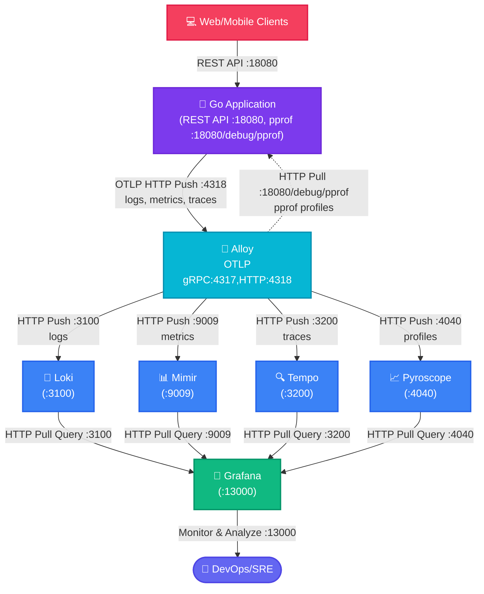

# Golang + OpenTelemetry + Zap + Alloy

- [หลักการ แนวคิด และวิธีการใช้งาน Grafana Loki](docs/Loki.md)


## Diagram การทำงาน



## ทดสอบส่ง Log ผ่าน OTLP ด้วย curl ไปยัง Alloy

Flow: `curl -> Alloy -> Loki <- Grafana Query`

```sh
# curl OLTP log to Alloy
make test-alloy-logs
```

ตรวจสอบใน Grafana

- เปิด Grafana ที่ http://localhost:13000
- ไปที่ Explore -> เลือก Data source เป็น Loki
- ลองใช้ LogQL query ดูข้อมูล

```LogQL
{service_name="test-service"}`
```

หรือ

```LogQL
{service_name=~".+"} | json
```

กดดู Query inspector -> Data ควรจะเห็นข้อมูลที่ส่งเข้ามา

## Golang + OpenTelemetry + Zap + Alloy

Alloy เป็น distribution ของ OpenTelemetry Collector ซึ่งเป็นเครื่องมือสำหรับการเก็บรวบรวม ประมวลผล และส่งออก telemetry data เช่น logs, traces, และ metrics โดยเฉพาะอย่างยิ่งสำหรับการส่ง log ไปยัง Alloy ผ่าน OTLP ด้วย HTTP ผู้ใช้สามารถใช้ Golang ในการสร้าง application ที่ generate log โดยใช้ Zap ซึ่งเป็น logging library ที่มีประสิทธิภาพสูง และส่ง log เหล่านั้นไปยัง Alloy เพื่อการวิเคราะห์ต่อไป

OTLP (OpenTelemetry Protocol) เป็น protocol ที่ออกแบบมาเพื่อส่ง telemetry data ไปยัง backend ที่รองรับ เช่น Alloy โดยสามารถใช้ผ่าน HTTP หรือ gRPC สำหรับกรณีโปรเจคนี้ จะใช้ HTTP ซึ่งจะต้องทำการส่งข้อมูลผ่าน HTTP POST ไปยัง endpoint ที่กำหนด เช่น `http://localhost:4318/v1/logs`

Zap เป็น logging library สำหรับ Golang ที่มีโครงสร้างและประสิทธิภาพสูง แต่โดยปกติแล้ว Zap ไม่รองรับ OTLP โดยตรง ดังนั้น การผสานรวมกับ OTLP จึงต้องใช้ bridge หรือ plugin ที่ช่วยแปลง log record จาก Zap เป็น format ของ OpenTelemetry เพื่อให้สามารถส่งผ่าน OTLP Protocol (`Emit`) ไปยัง Alloy ได้ ดูตัวอย่างได้ที่ `pkg/otlp/otlp.go`

```sh
# Generate random log via golang endpoint
curl http://localhost:18080/demo/logs

# Generate random logs via golang endpoint
make test-go-random-logs
```


Generate some load on the application:

```sh
for i in {1..5}; do
  curl -s "http://localhost:18080/demo/work" > /dev/null &
  curl -s "http://localhost:18080/demo/cpu" > /dev/null &
  curl -s "http://localhost:18080/demo/memory" > /dev/null
  sleep 1
done
```


## 


## xxx

```sh
docker compose down
docker compose up --force-recreate -d
```


## Reference

- [How-to-ingest-logs-with-alloy-or-the-opentelemetry-collector](https://grafana.com/blog/2025/02/24/grafana-loki-101-how-to-ingest-logs-with-alloy-or-the-opentelemetry-collector/)
- [Scaling Observability to 50TB+ of Telemetry a Day at Wise](https://www.youtube.com/watch?v=Sd8epoCHoi0)
