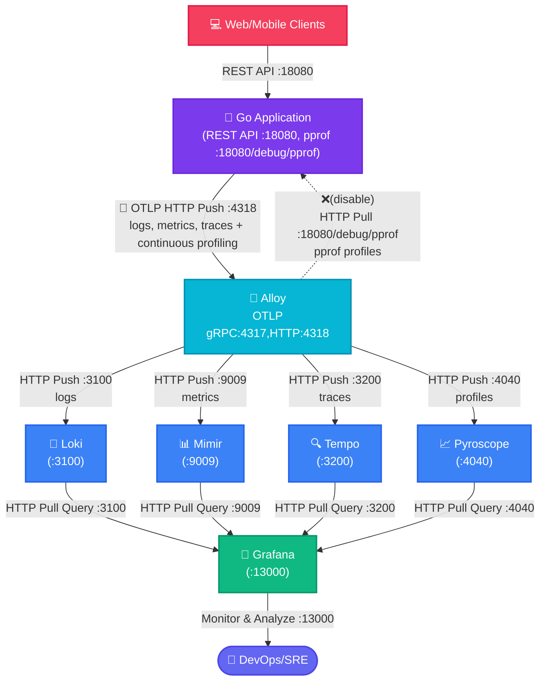
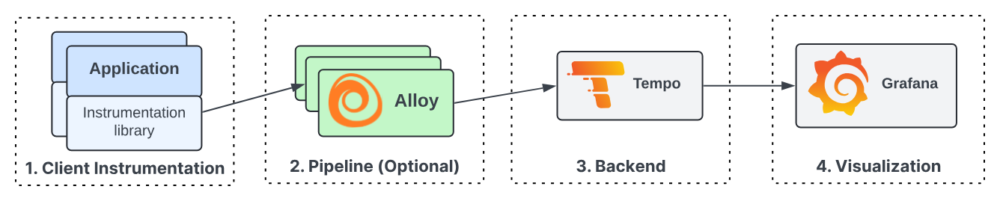
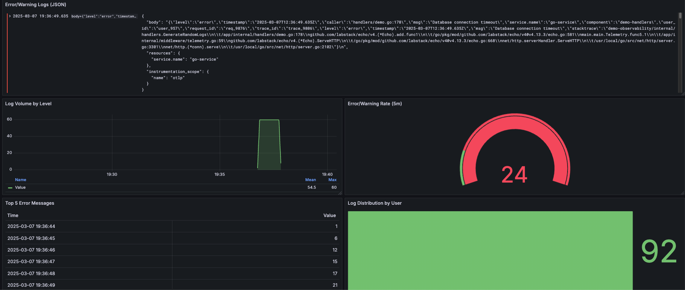
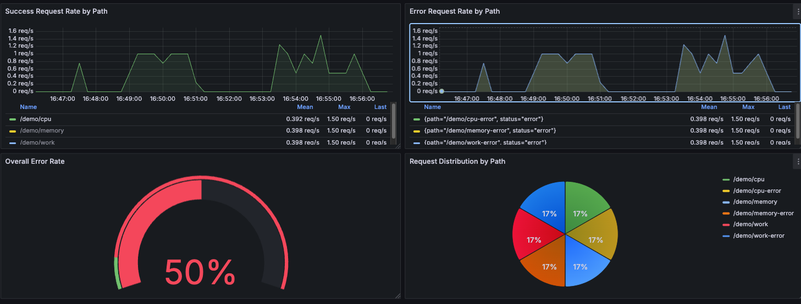
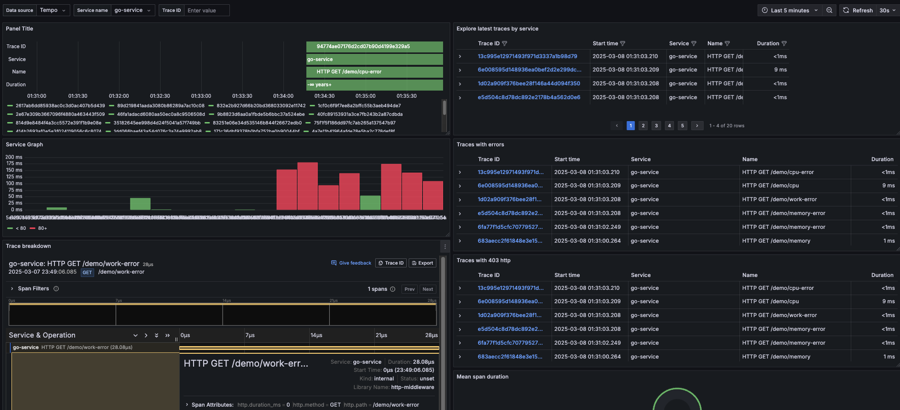
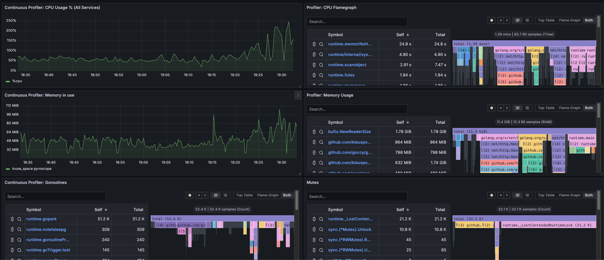

# Golang + OpenTelemetry + Zap + Alloy

## Overview

This project demonstrates how to use Golang with OpenTelemetry for logging, metrics, and tracing. It also includes a simple HTTP server for generating logs, metrics, and traces.

- [การใช้งาน Grafana Loki สำหรับ Logging](docs/Loki.md)
- [การใช้งาน Grafana Tempo สำหรับ Distributed Tracing](docs/Tempo.md)
- [การใช้งาน Grafana Mimir สำหรับ Metrics](docs/Mimir.md)

## Diagram การทำงาน



Alloy เป็น distribution ของ OpenTelemetry Collector ซึ่งเป็นเครื่องมือสำหรับการเก็บรวบรวม ประมวลผล และส่งออก telemetry data เช่น logs, traces, และ metrics โดยเฉพาะอย่างยิ่งสำหรับการส่ง log ไปยัง Alloy ผ่าน OTLP ด้วย HTTP ผู้ใช้สามารถใช้ Golang ในการสร้าง application ที่ generate log โดยใช้ Zap ซึ่งเป็น logging library ที่มีประสิทธิภาพสูง และส่ง log เหล่านั้นไปยัง Alloy เพื่อการวิเคราะห์ต่อไป

OTLP (OpenTelemetry Protocol) เป็น protocol ที่ออกแบบมาเพื่อส่ง telemetry data ไปยัง backend ที่รองรับ เช่น Alloy โดยสามารถใช้ผ่าน HTTP หรือ gRPC สำหรับกรณีโปรเจคนี้ จะใช้ HTTP ซึ่งจะต้องทำการส่งข้อมูลผ่าน HTTP POST ไปยัง endpoint ที่กำหนด เช่น `http://localhost:4318/v1/logs`

Zap เป็น logging library สำหรับ Golang ที่มีโครงสร้างและประสิทธิภาพสูง แต่โดยปกติแล้ว Zap ไม่รองรับ OTLP โดยตรง ดังนั้น การผสานรวมกับ OTLP จึงต้องใช้ bridge หรือ plugin ที่ช่วยแปลง log record จาก Zap เป็น format ของ OpenTelemetry เพื่อให้สามารถส่งผ่าน OTLP Protocol (`Emit`) ไปยัง Alloy ได้ ดูตัวอย่างได้ที่ `pkg/otlp/otlp.go`

- **Logs Management**: ใช้ Loki เก็บและค้นหา logs
- **Metrics Monitoring**: ใช้ Mimir เก็บ metrics แบบ long-term storage
- **Distributed Tracing**: ใช้ Tempo ติดตาม requests across services
- **Continuous Profiling**: ใช้ Pyroscope วิเคราะห์ performance
- **Unified Collection**: ใช้ Grafana Alloy เป็น collector รวมศูนย์



Go app สร้าง metrics ผ่าน OpenTelemetry SDK และส่งไปยัง Alloy ผ่าน OTLP HTTP Push (ไม่ได้ทำงานแบบ Pull-based เหมือน Prometheus ซึ่ง app ต้องเปิด metrics endpoint ให้) ข้อดีของการใช้ Push-based คือ เหมาะกับ dynamic environments, สามารถส่งข้อมูลได้แม้อยู่หลัง firewall






## Quick Start

### Prerequisites

- Docker และ Docker Compose
- Go 1.21 หรือสูงกว่า
- Make

### Installation

```bash
# Start all services
docker compose up -d

# Rebuild and restart specific services
docker compose up --force-recreate -d
```

### TL;DR

```bash
# สร้าง observability data(logs/metrics/traces + profiling) ด้วย Go application 
# แล้วไปเปิด Grafana Dashboard http://localhost:13000/dashboards ดูผลเลย
make generate-go-load
```

### Testing Components

Testing Logs (Loki)

```bash
# ทดสอบส่ง logs ผ่าน OTLP ด้วย curl ไปยัง Alloy
make test-alloy-logs

# สร้าง random logs จาก Go application
make test-go-random-logs
```

Testing Metrics (Mimir)

```bash
# ทดสอบส่ง gauge metrics ผ่าน OTLP ด้วย curl ไปยัง Alloy
make test-alloy-metrics-gauge

# ทดสอบส่ง counter metrics ผ่าน OTLP ด้วย curl ไปยัง Alloy
make test-alloy-metrics-sum-counter

# ทดสอบส่ง metrics จาก Go application
make test-go-load
```

Testing Traces (Tempo)

```bash
# ทดสอบส่ง traces ผ่าน OTLP ด้วย curl ไปยัง Alloy
make test-alloy-traces

# สร้าง load ด้วย Go application เพื่อทดสอบ traces (และ metrics)
make test-go-load
```

```bash
# สร้าง observability data(logs/metrics/traces + profiling) ด้วย Go application เพื่อไปใช้ใน Grafana Dashboard
make generate-go-load
```

### Accessing Dashboards

Grafana: http://localhost:13000

- Default credentials: admin/admin
- Available datasources:
  - Loki (Logs)
  - Mimir (Metrics)
  - Tempo (Traces)
  - Pyroscope (Profiles)

#### Logs Data source

ไปที่ Explore -> เลือก Data source เป็น Loki
ลองใช้ LogQL query ดูข้อมูล

```LogQL
{service_name="test-service"}`

{service_name=~".+"} | json
```

กดดู Query inspector -> Data ควรจะเห็นข้อมูลที่ส่งเข้ามา

#### Metrics Data source

ดู metrics ผ่าน Grafana Explore หรือ custom dashboards

ตัวอย่าง PromQL queries

```promql
rate(test_counter[5m])
test_gauge
```

#### Trace Analysis

- ใช้ Tempo dashboard สำหรับ distributed tracing
- Service Graph แสดงความสัมพันธ์ระหว่าง services
- Trace details แสดงรายละเอียดของแต่ละ request

## อื่นๆ

```sh
# Generate random log via golang endpoint
curl http://localhost:18080/demo/logs

# Generate random logs via golang endpoint
make test-go-random-logs
```

Generate some load on the application:

```sh
for i in {1..5}; do
  curl -s "http://localhost:18080/demo/work" > /dev/null &
  curl -s "http://localhost:18080/demo/cpu" > /dev/null &
  curl -s "http://localhost:18080/demo/memory" > /dev/null
  sleep 1
done
```

## References

- [How-to-ingest-logs-with-alloy-or-the-opentelemetry-collector](https://grafana.com/blog/2025/02/24/grafana-loki-101-how-to-ingest-logs-with-alloy-or-the-opentelemetry-collector/)
- [Scaling Observability to 50TB+ of Telemetry a Day at Wise](https://www.youtube.com/watch?v=Sd8epoCHoi0)
- [Mimir to use Minio(s3) as object storage backend](https://grafana.com/docs/mimir/latest/get-started/play-with-grafana-mimir/)
- [Alloy source code of metric handler to be MetricTypeCounter or MetricTypeGauge by passing aggregationTemporality and isMonotonic](https://github1s.com/grafana/alloy/blob/main/internal/component/otelcol/exporter/prometheus/internal/convert/convert.go#L413-L414)
- [Tracing in Grafana](https://grafana.com/docs/tempo/latest/getting-started/best-practices/)
- [Trace Virtualize](https://grafana.com/docs/grafana-cloud/visualizations/panels-visualizations/visualizations/traces/#add-traceql-with-table-visualizations)
- [Grafana Play](https://play.grafana.org/)
