# Golang + OpenTelemetry + Zap + Alloy

## ภาพรวม

โปรเจคนี้แสดงการทำ Observability โดยใช้ Golang ร่วมกับ OpenTelemetry สำหรับการจัดการ logging, metrics, tracing และ continuous profiler โดยมีการติดตามประสิทธิภาพของแอปพลิเคชันดังนี้

- **Logging**: การรวบรวม log แบบรวมศูนย์โดยใช้ Grafana Loki
- **Metrics**: การจัดเก็บ metric ประสิทธิภาพสูงด้วย Grafana Mimir
- **Tracing**: การติดตาม request แบบกระจายผ่าน Grafana Tempo
- **Profiling**: การทำ profiling ประสิทธิภาพอย่างต่อเนื่องด้วย Pyroscope
- **Collection**: การรวบรวมข้อมูลแบบรวมศูนย์ผ่าน Grafana Alloy

ลิงค์เอกสารเพิ่มเติม

- [Grafana Loki สำหรับ Logging](docs/Loki.md)
- [Grafana Tempo สำหรับ Distributed Tracing](docs/Tempo.md)
- [Grafana Mimir สำหรับ Metrics](docs/Mimir.md)
- [การใช้งาน MinIO(S3-compatible) และสถาปัตยกรรม Mimir + MinIO ที่ใช้ในโปรเจค](docs/Minio-Mimir-Architecture.md)
- [Traditional/Continueus Profilier ด้วย OpenTelemetry, Alloy และ Pyroscope](docs/Pyroscope.md)

## Diagram Architecture

```mermaid
flowchart TB
    %% Define components with ports
    Client["💻 Web/Mobile Clients/Curl"]
    GoApp["🚀 Go Application<br/>(REST API :18080, pprof :18080/debug/pprof)"]
    Alloy["📡 Alloy<br/>OTLP<br/>gRPC:4317,HTTP:4318"]
    LoadBalancerPush["⚖️ Load Balancer (Push)<br/>(Nginx)"]
    LoadBalancerQuery["⚖️ Load Balancer (Query)<br/>(Nginx)"]
    Loki["📝 Loki x1<br/>(:3100)"]
    Mimir["📊 Mimir x3<br/>(:9009)"]
    Tempo["🔍 Tempo x1<br/>(:3200)"]
    Pyroscope["📈 Pyroscope x1<br/>(:4040)"]
    Grafana["🎯 Grafana<br/>(:13000)"]
    DevOps(["👤 DevOps/SRE"])

    %% Client to Application flow
    Client -->|"REST API :18080"| GoApp
    
    %% Telemetry flow from Go Application to Alloy
    GoApp -->|"🚌 OTLP HTTP Push :4318<br/>logs, metrics, traces + continuous profiling"| Alloy

    %% Profile pull from Alloy to Go Application
    Alloy -.->|"❌(disable)<br/>HTTP Pull :18080/debug/pprof<br/>pprof profiles"| GoApp

    %% Data flow from Alloy through Load Balancer (Push) to storage systems
    Alloy -->|"HTTP Push :13100<br/>logs"| LoadBalancerPush
    Alloy -->|"HTTP Push :19009<br/>metrics"| LoadBalancerPush
    Alloy -->|"HTTP Push :14318<br/>traces"| LoadBalancerPush
    Alloy -->|"HTTP Push :14040<br/>profiles"| LoadBalancerPush

    %% Load Balancer (Push) to storage systems
    LoadBalancerPush -->|"HTTP Push :3100<br/>logs"| Loki
    LoadBalancerPush -->|"HTTP Push :9009<br/>metrics"| Mimir
    LoadBalancerPush -->|"HTTP Push :4318<br/>traces"| Tempo
    LoadBalancerPush -->|"HTTP Push :4040<br/>profiles"| Pyroscope

    %% Storage to Load Balancer (Query)
    Loki -->|"HTTP Pull :3100"| LoadBalancerQuery
    Mimir -->|"HTTP Pull :9009"| LoadBalancerQuery
    Tempo -->|"HTTP Pull :3200"| LoadBalancerQuery
    Pyroscope -->|"HTTP Pull :4040"| LoadBalancerQuery

    %% Load Balancer (Query) to Grafana
    LoadBalancerQuery -->|"HTTP Pull :13100<br/>logs"| Grafana
    LoadBalancerQuery -->|"HTTP Pull :19009<br/>metrics"| Grafana
    LoadBalancerQuery -->|"HTTP Pull :13200<br/>traces"| Grafana
    LoadBalancerQuery -->|"HTTP Pull :14040<br/>profiles"| Grafana
    
    %% DevOps at bottom
    Grafana -->|"Monitor & Analyze :13000"| DevOps

    %% Modern styling
    classDef default fill:#ffffff,stroke:#2d3748,stroke-width:2px;
    classDef client fill:#f43f5e,color:#ffffff,stroke:#e11d48,stroke-width:2px;
    classDef app fill:#7c3aed,color:#ffffff,stroke:#6d28d9,stroke-width:2px;
    classDef collector fill:#06b6d4,color:#ffffff,stroke:#0891b2,stroke-width:2px;
    classDef storage fill:#3b82f6,color:#ffffff,stroke:#2563eb,stroke-width:2px;
    classDef viz fill:#10b981,color:#ffffff,stroke:#059669,stroke-width:2px;
    classDef user fill:#6366f1,color:#ffffff,stroke:#4f46e5,stroke-width:2px;
    classDef loadbalancer fill:#f97316,color:#ffffff,stroke:#ea580c,stroke-width:2px;
    
    class Client client;
    class GoApp app;
    class Alloy collector;
    class LoadBalancerPush,LoadBalancerQuery loadbalancer;
    class Loki,Mimir,Tempo,Pyroscope storage;
    class Grafana viz;
    class DevOps user;
```



## MinIO(S3) and Mimir Architecture


## การทำงานของระบบ

Alloy คือ distribution ของ OpenTelemetry Collector ซึ่งเป็นเครื่องมือสำหรับการรวบรวม ประมวลผล และส่งออก telemetry data เช่น logs, traces, และ metrics โดยเฉพาะการส่ง logs ไปยัง Alloy ผ่าน OTLP ด้วย HTTP ผู้ใช้สามารถพัฒนาแอปพลิเคชันด้วย Golang และใช้ Zap ซึ่งเป็น logging library ในการสร้าง logs และส่งไปยัง Alloy เพื่อการวิเคราะห์ต่อไป

OTLP (OpenTelemetry Protocol) เป็นโปรโตคอลที่ออกแบบมาเพื่อส่ง telemetry data ไปยัง backend ที่รองรับ เช่น Alloy โดยสามารถใช้ได้ทั้งผ่าน HTTP และ gRPC สำหรับโปรเจกต์นี้ จะใช้การส่งข้อมูลผ่าน HTTP โดยส่งผ่าน HTTP POST ไปยัง endpoint ที่กำหนด เช่น `http://localhost:4318/v1/logs`

Zap เป็น logging library สำหรับ Golang ที่มีความยืดหยุ่นและประสิทธิภาพสูง แต่เนื่องจาก Zap ไม่รองรับ OTLP โดยตรง การผสานรวมจึงต้องใช้ bridge หรือ plugin ที่ช่วยแปลง log records จาก Zap ให้อยู่ในรูปแบบของ OpenTelemetry เพื่อส่งผ่าน OTLP Protocol (`Emit`) ไปยัง Alloy ได้ ตัวอย่างสามารถดูได้ที่ `pkg/otlp/otlp.go`

ระบบประกอบด้วยส่วนประกอบหลักดังนี้:

- **การจัดการ Logs**: ใช้ Loki เก็บและค้นหา logs
- **การติดตาม Metrics**: ใช้ Mimir เก็บ metrics แบบ long-term storage
- **Distributed Tracing**: ใช้ Tempo ติดตาม requests across services
- **Continuous Profiling**: ใช้ Pyroscope วิเคราะห์ performance
- **Unified Collection**: ใช้ Grafana Alloy เป็น collector รวมศูนย์


แอปพลิเคชัน Go สร้าง metrics โดยใช้ OpenTelemetry SDK และส่งไปยัง Alloy ผ่าน OTLP HTTP Push ซึ่งแตกต่างจาก Prometheus ที่ใช้การดึงข้อมูล (Pull-based) ซึ่งต้องเปิด metrics endpoint ภายในแอปพลิเคชันเอง ข้อดีของการใช้รูปแบบ Push-based คือเหมาะกับสภาพแวดล้อมแบบไดนามิก (dynamic environments) และสามารถส่งข้อมูลได้แม้อยู่หลัง firewall


## Quick Start

### Prerequisites

- Docker และ Docker Compose
- Go 1.21 หรือสูงกว่า
- Make

ตรวจสอบให้แน่ใจว่าได้ติดตั้งและตั้งค่าความต้องการทั้งหมดอย่างถูกต้องก่อนดำเนินการติดตั้ง

### การติดตั้งและการตั้งค่าเริ่มต้น

1. Clone repository
2. เริ่มต้นบริการทั้งหมด:

```bash
# สร้าง observability data(logs/metrics/traces + profiling) ด้วย Go application 
make clean && make up && make generate-go-load 

# Grafana Dashboard http://localhost:13000/dashboards 
open http://localhost:13000/dashboards

# Alloy UI
open http://localhost:12345

# Minio(s3) Object Storage UI (mimir:supersecret)
open http://localhost:19001/browser
```

### Testing Components

Testing Logs (Loki)

```bash
# ทดสอบส่ง logs ผ่าน OTLP ด้วย curl ไปยัง Alloy
make test-alloy-logs

# สร้าง random logs จาก Go application
make test-go-random-logs
```

Testing Metrics (Mimir)

```bash
# ทดสอบส่ง gauge metrics ผ่าน OTLP ด้วย curl ไปยัง Alloy
make test-alloy-metrics-gauge

# ทดสอบส่ง counter metrics ผ่าน OTLP ด้วย curl ไปยัง Alloy
make test-alloy-metrics-sum-counter

# ทดสอบส่ง metrics จาก Go application
make test-go-load
```

Testing Traces (Tempo)

```bash
# ทดสอบส่ง traces ผ่าน OTLP ด้วย curl ไปยัง Alloy
make test-alloy-traces

# สร้าง load ด้วย Go application เพื่อทดสอบ traces (และ metrics)
make test-go-load
```

```bash
# สร้าง observability data(logs/metrics/traces + profiling) ด้วย Go application เพื่อไปใช้ใน Grafana Dashboard
make generate-go-load
```

### Accessing Dashboards

Grafana: <http://localhost:13000>

- Default credentials: admin/admin
- Available datasources:
  - Loki (Logs)
  - Mimir (Metrics)
  - Tempo (Traces)
  - Pyroscope (Profiles)

#### Logs Data source

ไปที่ Explore -> เลือก Data source เป็น Loki
ลองใช้ LogQL query ดูข้อมูล

```LogQL
{service_name="test-service"}`

{service_name=~".+"} | json
```

กดดู Query inspector -> Data ควรจะเห็นข้อมูลที่ส่งเข้ามา

#### Metrics Data source

ดู metrics ผ่าน Grafana Explore หรือ custom dashboards

ตัวอย่าง PromQL queries

```promql
rate(test_counter[5m])
test_gauge
```

#### Trace Analysis

- ใช้ Tempo dashboard สำหรับ distributed tracing
- Service Graph แสดงความสัมพันธ์ระหว่าง services
- Trace details แสดงรายละเอียดของแต่ละ request

## อื่นๆ

```sh
# Generate random log via golang endpoint
curl http://localhost:18080/demo/logs

# Generate random logs via golang endpoint
make test-go-random-logs
```

Generate some load on the application:

```sh
for i in {1..5}; do
  curl -s "http://localhost:18080/demo/work" > /dev/null &
  curl -s "http://localhost:18080/demo/cpu" > /dev/null &
  curl -s "http://localhost:18080/demo/memory" > /dev/null
  sleep 1
done
```

## References

- [How-to-ingest-logs-with-alloy-or-the-opentelemetry-collector](https://grafana.com/blog/2025/02/24/grafana-loki-101-how-to-ingest-logs-with-alloy-or-the-opentelemetry-collector/)
- [Scaling Observability to 50TB+ of Telemetry a Day at Wise](https://www.youtube.com/watch?v=Sd8epoCHoi0)
- [Mimir to use Minio(s3) as object storage backend](https://grafana.com/docs/mimir/latest/get-started/play-with-grafana-mimir/)
- [Alloy source code of metric handler to be MetricTypeCounter or MetricTypeGauge by passing aggregationTemporality and isMonotonic](https://github1s.com/grafana/alloy/blob/main/internal/component/otelcol/exporter/prometheus/internal/convert/convert.go#L413-L414)
- [Tracing in Grafana](https://grafana.com/docs/tempo/latest/getting-started/best-practices/)
- [Trace Virtualize](https://grafana.com/docs/grafana-cloud/visualizations/panels-visualizations/visualizations/traces/#add-traceql-with-table-visualizations)
- [Grafana Play](https://play.grafana.org/)
