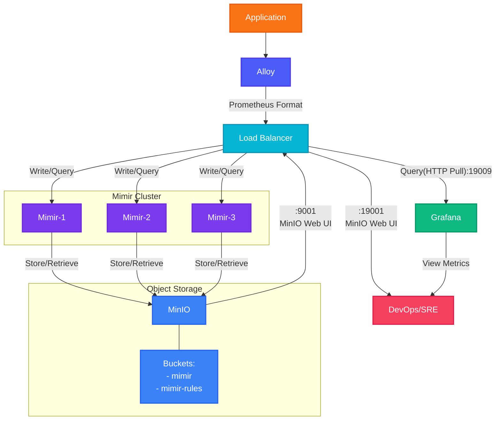

# MinIO and Mimir Architecture

## สถาปัตยกรรมและการทำงาน

### 1. การไหลของข้อมูล (Data Flow)

- **Application → Alloy**:
  - แอปพลิเคชันส่ง metrics ไปยัง Alloy ผ่าน OTLP HTTP Push
  - Alloy ทำหน้าที่รวบรวมและแปลงข้อมูลให้อยู่ในรูปแบบที่ Mimir เข้าใจได้

- **Alloy → Mimir**:
  - Alloy แปลงข้อมูลให้อยู่ในรูปแบบ Prometheus remote write
  - Load Balancer กระจาย requests ไปยัง Mimir instances ต่างๆ เพื่อการทำงานแบบ high availability

### 2. Mimir Cluster

- **High Availability**:
  - ประกอบด้วย Mimir 3 instances ทำงานพร้อมกัน
  - แต่ละ instance สามารถรับ write และ query requests ได้
  - หากมี instance ใดล้มเหลว instances อื่นยังคงให้บริการได้ต่อเนื่อง

- **การจัดการข้อมูล**:
  - ทุก instance มีสิทธิ์เข้าถึง MinIO เท่าเทียมกัน
  - ใช้ S3 compatible API ในการอ่าน/เขียนข้อมูลกับ MinIO
  - รองรับการทำ horizontal scaling โดยเพิ่ม instances ได้ตามต้องการ

### 3. MinIO Object Storage

- **การจัดเก็บข้อมูล**:
  - ทำหน้าที่เป็น distributed object storage
  - รองรับการเก็บข้อมูลขนาดใหญ่และการเข้าถึงแบบ concurrent
  - มีระบบ data replication ในตัวเพื่อความทนทานของข้อมูล
  - ลดความซับซ้อนในการ sync ข้อมูลระหว่าง availability zones
  - ประหยัดค่าใช้จ่ายด้านเครือข่ายเมื่อเทียบกับระบบไฟล์แบบดั้งเดิม

- **ความสามารถหลัก**:
  - รองรับ S3 API ทำให้ง่ายต่อการพัฒนาและบำรุงรักษา
  - มีระบบรักษาความสอดคล้องของข้อมูล (consistency)
  - รองรับการทำ disaster recovery
  - สามารถขยายระบบได้ตามปริมาณข้อมูลที่เพิ่มขึ้น

- **Buckets**:
  - `mimir`: เก็บข้อมูล metrics ทั้งหมด
    - Time series data
    - Metadata
    - Indexes
  - `mimir-rules`: เก็บ configuration สำหรับ alerting rules
    - Alert rules
    - Recording rules
    - Alert templates

### 4. การเข้าถึงระบบ

- **Metrics Access**:
  - Load Balancer เปิด port 19009 สำหรับ Prometheus API
  - Grafana ใช้ port นี้ในการ query ข้อมูลจาก Mimir
  - รองรับ PromQL queries และ Prometheus remote write

- **Management**:
  - MinIO Web UI: เข้าถึงผ่าน port 19001
  - ใช้สำหรับ monitor storage usage และจัดการ buckets
  - มี dashboard แสดงสถานะและ performance metrics

- **Monitoring**:
  - Grafana dashboards แสดงข้อมูล metrics จาก Mimir
  - สามารถสร้าง custom dashboards และ alerts
  - รองรับการ visualize ข้อมูลในหลากหลายรูปแบบ