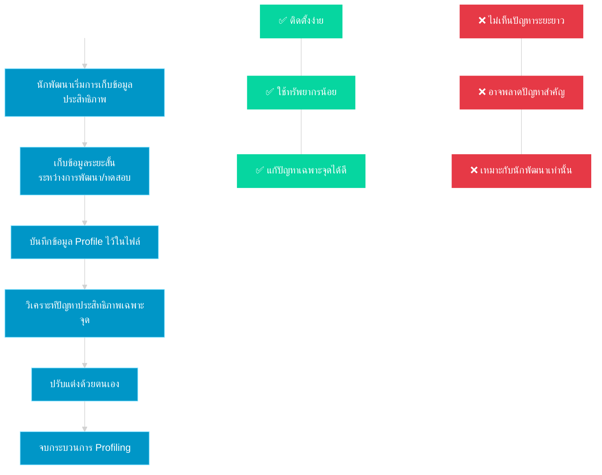
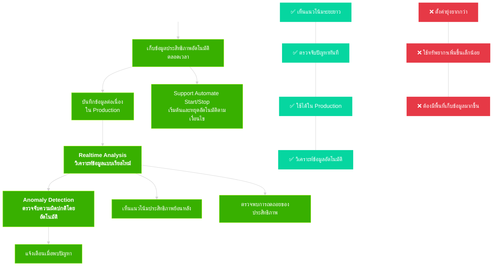

# Continuous Profiling in Golang using OpenTelemetry and Pyroscope

## Profiling คืออะไร?

**Profiling** คือกระบวนการเก็บและวิเคราะห์ข้อมูลการทำงานของโปรแกรม เพื่อหาจุดที่ใช้ทรัพยากรมาก (CPU, RAM) หรือทำงานช้า ช่วยให้เรารู้ว่าควรปรับปรุงโค้ดตรงส่วนไหน

### Traditional Profiling ใน Go

Go มีเครื่องมือ profiling ในตัวผ่าน package `runtime/pprof` และ `net/http/pprof` ซึ่งช่วยให้เราสามารถเก็บข้อมูลประสิทธิภาพได้ แต่มีข้อจำกัดในการใช้งานจริงบางประการ

```go
// ตัวอย่างการใช้ pprof แบบดั้งเดิมใน Go
import (
    _ "net/http/pprof" // เปิดใช้ pprof http handler
    "runtime/pprof"
    "os"
)

func main() {
    // สร้างไฟล์เก็บข้อมูล CPU profiling
    f, _ := os.Create("cpu.prof")
    pprof.StartCPUProfile(f)
    defer pprof.StopCPUProfile()
    
    // ติดตั้ง pprof handler สำหรับ echo framework ในกรณีที่จะเปิดใช้ profiler endpoints
    e := echo.New()
    e.GET("/debug/pprof/*", echo.WrapHandler(http.DefaultServeMux))

    // โค้ดอื่นๆ...
    
    // เก็บข้อมูล memory profile
    f2, _ := os.Create("mem.prof")
    pprof.WriteHeapProfile(f2)
}
```



**ข้อจำกัดของ Traditional Profiling:**

- ต้องเริ่มและหยุด profiling ด้วยตนเอง
- เก็บข้อมูลเพียงช่วงเวลาสั้นๆ ที่ทำการ profiling
- อาจไม่พบปัญหาที่เกิดขึ้นเฉพาะบางช่วงเวลา
- ต้องวิเคราะห์ข้อมูลแยกกับระบบ monitoring อื่นๆ
- มักใช้ในสภาพแวดล้อมทดสอบ ไม่ใช่ production

## Continuous Profiling คืออะไร?

**Continuous Profiling** คือการเก็บข้อมูล profiling ต่อเนื่องตลอดเวลาที่แอปทำงาน โดยสร้าง overhead น้อยพอที่จะใช้ในระบบ production ได้



### ข้อดีของ Continuous Profiling

1. **เฝ้าระวังอัตโนมัติ**: ระบบทำงานตลอดเวลาโดยไม่ต้องสั่งเริ่ม-หยุด
2. **Low Overhead**: สร้างภาระให้ระบบน้อย เราสามารถใส่เข้าไปใน span ของ tracer ได้เลยทำให้ใช้ใน production env ได้
3. **ข้อมูลย้อนหลัง**: สามารถดูข้อมูลประสิทธิภาพย้อนหลังเพื่อวิเคราะห์ปัญหาได้
4. **ตรวจจับปัญหาแบบ Intermittent**: จับปัญหาที่เกิดเป็นครั้งคราวได้

## Pyroscope คืออะไร?

**Pyroscope** คือ open-source tool สำหรับทำ Continuous Profiling ที่อยู่ในตระกูล Grafana ช่วยให้เราสามารถเก็บ เก็บรักษา และวิเคราะห์ข้อมูล profiling ได้อย่างมีประสิทธิภาพ สามารถใช้งานร่วมกับภาษาต่างๆ รวมถึง Go ได้

## การทำงานในโปรเจคนี้: Go -> Alloy -> Pyroscope

###  การ Initialize Profiling ในโปรเจคนี้

โปรเจคนี้ใช้ Continuous Profiling ผ่าน OpenTelemetry และส่งข้อมูลไปยัง Pyroscope (ซึ่งเป็นส่วนหนึ่งของ Grafana Alloy) โดยมีขั้นตอนดังนี้

0. ไลบรารีหลักที่ใช้

- OpenTelemetry (OTEL) เพื่อส่งข้อมูล profiling ไปยัง Alloy
- Go Runtime Package เพื่อเก็บข้อมูล profiling ของ Go Runtime

1. การเปิดใช้งาน Runtime Profiling

```golang
func initTelemetry() {
    // Enable runtime profiling
    runtime.SetMutexProfileFraction(5)  // Enable mutex profiling
    runtime.SetBlockProfileRate(5)      // Enable goroutine blocking profiling
    
    // ... code อื่นๆ
}
```

- `runtime.SetMutexProfileFraction(5)`: เปิดใช้งาน mutex profiling โดยค่า 5 หมายถึงจะเก็บข้อมูลประมาณ 1 ใน 5 ของการใช้งาน mutex ทั้งหมด ช่วยให้เราตรวจสอบได้ว่ามีการแย่งชิงทรัพยากร (contention) ที่ mutex หรือไม่ ถ้าไม่เรียกใช้ `runtime.SetMutexProfileFraction(5)` จะไม่มีการเก็บข้อมูลเกี่ยวกับการแย่งชิง mutex ส่งออกไปเพราะค่าเริ่มต้นของ MutexProfileFraction คือ 0 ซึ่งหมายถึงปิดการเก็บข้อมูล

- `runtime.SetBlockProfileRate(5)`: เปิดใช้งาน goroutine blocking profiling โดยค่า 5 หมายถึงจะเก็บข้อมูลเมื่อ goroutine ถูกบล็อคนานกว่า 5 นาโนวินาที ช่วยให้เราตรวจสอบได้ว่า goroutine ติดขัดที่จุดไหนบ้าง ถ้าไม่เรียกใช้ runtime.SetBlockProfileRate(5) จะไม่มีการเก็บข้อมูลเกี่ยวกับการติดขัดของ goroutine เพราะค่าเริ่มต้นของ BlockProfileRate คือ 0 ซึ่งหมายถึงปิดการเก็บข้อมูล

2. การสร้าง OpenTelemetry Resource

```golang
// Create OpenTelemetry resource
res, err := resource.New(context.Background(),
    resource.WithAttributes(
        semconv.ServiceName("go-service"),
    ),
)
```

สร้าง resource ของ OpenTelemetry:

- resource.New : สร้าง resource ใหม่ที่จะใช้ในการส่งข้อมูล telemetry
- resource.WithAttributes : กำหนด attributes ให้กับ resource
- semconv.ServiceName("go-service") : กำหนดชื่อบริการเป็น "go-service" ตามมาตรฐาน semantic conventions ของ OpenTelemetry

3. จำลองเคสการใช้งาน Profiling ในโค้ด

จำลอง Memory Leak

- สร้าง span ใหม่ด้วย tracer.Start เพื่อติดตามการทำงาน
- จองหน่วยความจำขนาด 1MB และเก็บไว้ใน slice ชื่อ leakedMemory (ซึ่งเป็นตัวแปรที่อยู่นอกฟังก์ชัน)
- ทุกครั้งที่เรียกฟังก์ชันนี้ จะมีการเพิ่มหน่วยความจำที่ใช้อีก 1MB โดยไม่มีการคืน (จำลอง memory leak)
- บันทึกข้อมูลลงใน span ด้วย span.SetAttributes

```golang
// Global variable to simulate memory leak
var leakedMemory [][]byte

// SimulateMemoryLeak gradually increases memory usage
func SimulateMemoryLeak(c echo.Context) error {
    _, span := tracer.Start(c.Request().Context(), "simulate-memory-leak")
    defer span.End()

    // Create a slice that will stay in memory
    data := make([]byte, 1024*1024) // 1MB
    for i := range data {
        data[i] = byte(i)
    }
    leakedMemory = append(leakedMemory, data)

    span.SetAttributes(attribute.Int("memory.leaked_mb", len(leakedMemory)))
    return c.JSON(200, map[string]interface{}{"leaked_mb": len(leakedMemory)})
}
```

จำลองการใช้ CPU สูง

- สร้าง span เช่นเดียวกับฟังก์ชันก่อนหน้า
- ทำการคำนวณในลูป 1 ล้านรอบ เพื่อจำลองการใช้ CPU สูง
- บันทึกผลลัพธ์ลงใน span

```golang
// SimulateCPULoad generates high CPU usage
func SimulateCPULoad(c echo.Context) error {
    _, span := tracer.Start(c.Request().Context(), "simulate-cpu-load")
    defer span.End()

    result := 0.0
    for i := 0; i < 1000000; i++ {
        result += float64(i) * rand.Float64()
    }

    span.SetAttributes(attribute.Float64("cpu.result", result))
    return c.JSON(200, map[string]interface{}{"result": result})
}
```

## References

- [What is Profiling?](https://grafana.com/docs/pyroscope/latest/introduction/what-is-profiling/)
- [Continuous Profiling Concepts](https://grafana.com/docs/pyroscope/latest/introduction/continuous-profiling/)
- [Profiling Types](https://grafana.com/docs/pyroscope/latest/introduction/profiling-types/)
- [Profile & Tracing Integration](https://grafana.com/docs/pyroscope/latest/introduction/profile-tracing/)
- [Go Profiling Documentation](https://pkg.go.dev/runtime/pprof)
- [Pyroscope Go Client](https://github.com/grafana/pyroscope-go)
- [Grafana Alloy Documentation](https://grafana.com/docs/alloy/)
